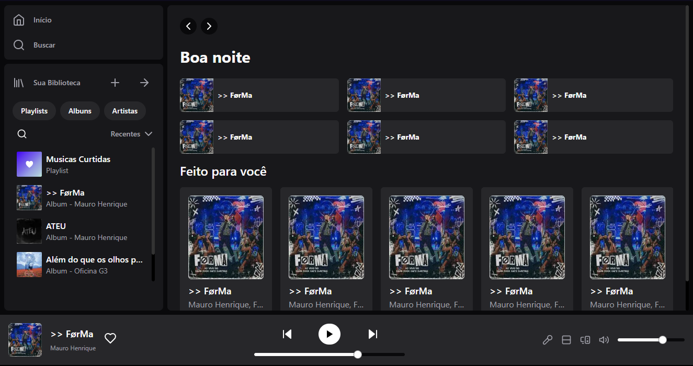

# Spotify Clone 🎵💚

## Getting Started 🧠

First, install the dependencies:

```bash
npm install
# or
yarn
# or
pnpm add

```

Afterwards, run the development server:

```bash
npm run dev
# or
yarn dev
# or
pnpm dev
```

Open the address [http://localhost:3000/](http://localhost:3000/) in your browser.

## Result


## Technologies used

* Next JS
* TailwindCSS
* React JS
* Radix UI
* ShadCn/UI
* Lucide-react
* HTML
* CSS

## Project status
<p>✅ finished</p>

### Author
---
Daniel Alves (devnoob547)